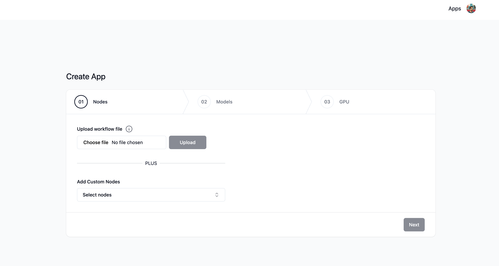
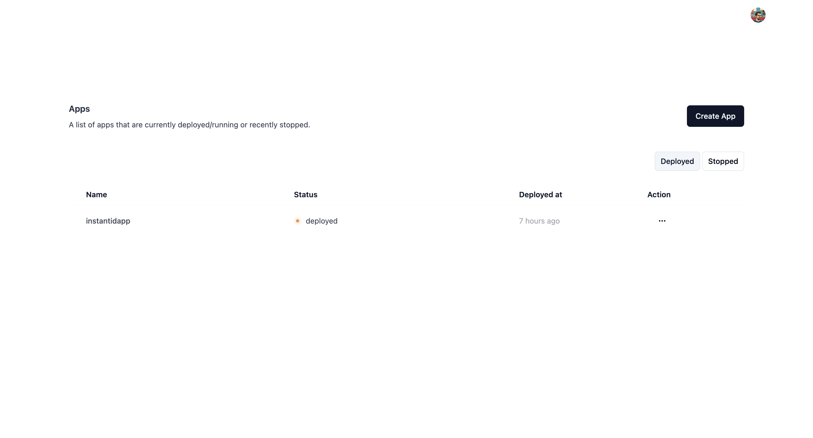
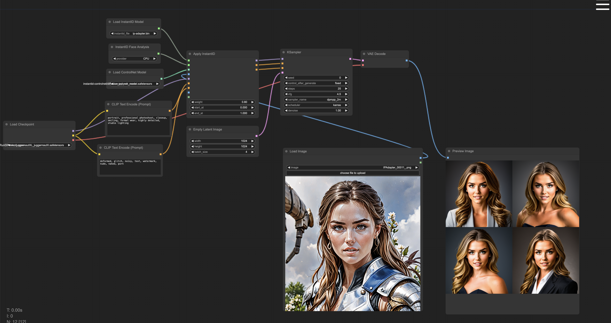

# ComfyRun

A fully open source and self-hosted solution to run your ComfyUI workflows at blazing fast speeds on cloud GPUs powered by [Modal](https://modal.com/).

Best suited for individuals who want to 

- Run complex workflows in seconds on the powerful GPUs like A10G, A100, and H100 🔋
- Experiment with any workflows you find across web without worrying about breaking your local ComfyUI environment 😎
- Edit workflows on the go 📱

## App Intro

[](https://www.youtube.com/watch?v=y1kMzXtIvVY)

## App Screenshots







## Requirements

Local Dev

- Node - `>=v20.x.x`
- Python - `>=3.10.x`
- Docker

For running self hosted solution, please sign-up for following services:

- [Modal account](https://modal.com/) - Running workflows
- [Clerk account](https://clerk.com/) - Authentication
- [Fly.io account](https://fly.io/) - Hosting

## Local Setup

### Frontend

Pre-requisites

- Node >v20.x.x - recommended to install via some node version manager like [nvm](https://github.com/nvm-sh/nvm) or [n](https://github.com/tj/n)

Once the Node is installed, please run below commands to install and run the app locally

#### 1. Change directory:

```sh
cd web/
```

#### 2. Install dependencies:

```sh
npm install
```

#### 3. Setup Environment variables:

Create `.env.` file from `.env.sample` and add required keys(more info in the video linked below)

```
cp .env.sample .env
```

#### 4. Run app

```sh
npm run dev
```

### Backend

Pre-requisites

- Install [Docker Desktop](https://www.docker.com/products/docker-desktop/) to avoid messing with Python virtual environment

#### 1. Change directory:

```sh
cd backend/
```

#### 2. Setup Environment variables:

Create `.env.` file from `.env.sample` and add required keys(more info in the video linked below)

```
cp .env.sample .env
```

#### 3. Run app

```sh
docker-compose -f docker-compose.local.yml up --build
```

> Note: Make sure docker desktop is running before running this command

## Hosting

Check out this video on how to self host this app

[](https://www.youtube.com/watch?v=xHzVPrXe4V8)

The current implementation hosts both frontend and backend on [Fly.io](https://fly.io/). However, you can use any other service of your choice to host using the Dockerfile for both frontend and backend

Pre-requisites

1. Clone the repo
2. Sign up on [Modal](https://modal.com/) & set token
3. Sign up on [Clerk](https://clerk.com/) & create app
4. Sign up on [Fly.io](https://fly.io/)
5. Install [flyctl](https://fly.io/docs/flyctl/install/)

### Frontend

#### 1. Change directory:

```sh
cd web/
```

#### 2. Create Fly app:

[Create App](./docs/flyio/create-flyio-app.md)

#### 3. Setup Environment variables:

You need to add all the environment variables present in your `./web/.env` file to Flyio [Secrets](https://fly.io/docs/apps/secrets/#setting-secrets) for Flyio to pick them during the deploy

You can setup via command line using [flyctl](https://fly.io/docs/apps/secrets/#set-secrets) or use the app dashboard page `https://fly.io/apps/<your-app-name>/secrets`

#### 4. Deploy app:

Make sure you're in `/web` directory before running below command

```sh
fly deploy
```

### Backend

#### 1. Change directory:

```sh
cd backend/
```

#### 2. Create Fly app:

[Create App](./docs/flyio/create-flyio-app.md) (Same steps as frontend)

#### 3. Setup Environment variables:

You need to add all the environment variables present in your `./backend/.env` file to Flyio [Secrets](https://fly.io/docs/apps/secrets/#setting-secrets) for Flyio to pick them during the deploy

You can setup via command line using [flyctl](https://fly.io/docs/apps/secrets/#set-secrets) or use the app dashboard page `https://fly.io/apps/<your-app-name>/secrets`

> Note: Make sure to include base url of the deployed frontend app from the above step in the comma separated list of `CORS_ALLOWED_ORIGINS` variable in your secrets

#### 4. Deploy app:

Make sure you're in `/backend` directory before running below command

```sh
fly deploy
```
