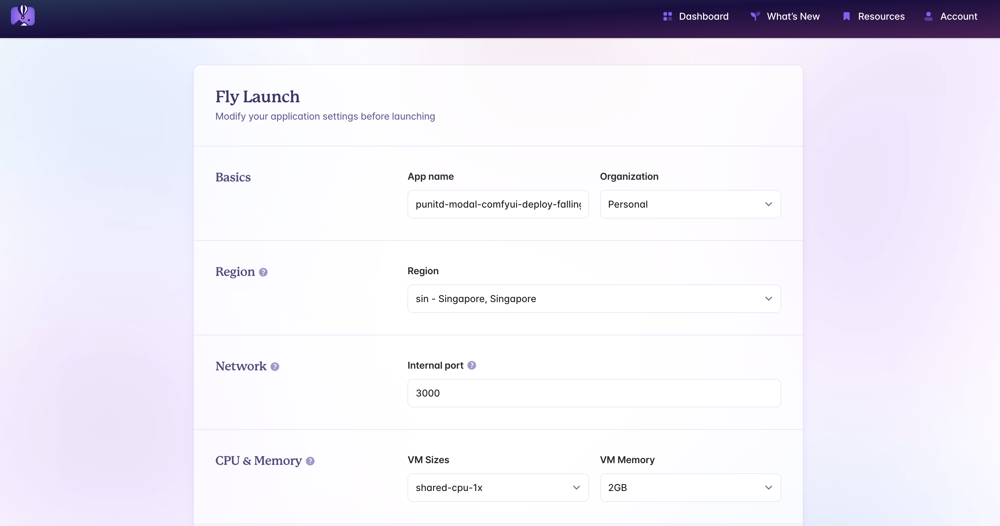

## Create Flyio App

Make sure you've installed [flyctl](https://fly.io/docs/flyctl/install/) before running this step

```sh
fly launch
```

You'll see following prompt, please enter "y" to copy the config:

```sh
An existing fly.toml file was found for app punitd-modal-comfyui-deploy
? Would you like to copy its configuration to the new app? (y/N)
```

You'll now see one more prompt confirming to deploy directly or launching a new app, please enter "y" as you'll be creating a new app
in this case

```sh
Scanning source code
Detected a Remix app
App 'punitd-modal-comfyui-deploy' already exists. You can deploy to it with `fly deploy`.
? Continue launching a new app?  (y/N)
```

You'll now see following prompt(final one) asking you whether you want to tweak app settings. Please select "y" to change config like name and region based on your choice

```sh
Creating app in /Users/punitdama/Personal/AI/modal-comfyui-deploy-app/web
We're about to launch your Remix app on Fly.io. Here's what you're getting:

Organization: PunitD                                          (fly launch defaults to the personal org)
Name:         punitd-modal-comfyui-deploy-falling-shadow-4219 (generated)
Region:       Singapore, Singapore                            (from your fly.toml)
App Machines: shared-cpu-1x, 2GB RAM                          (from your fly.toml)
Postgres:     <none>                                          (not requested)
Redis:        <none>                                          (not requested)
Tigris:       <none>                                          (not requested)

? Do you want to tweak these settings before proceeding? (y/N)
```

You'll be redirected to web page which would look like below:



Enter app name, region, VM sizes as per you choice and requirements

Click "Confirm Settings" and you'de be redirected back to terminal.
You're app is now ready to deploy! 😎
